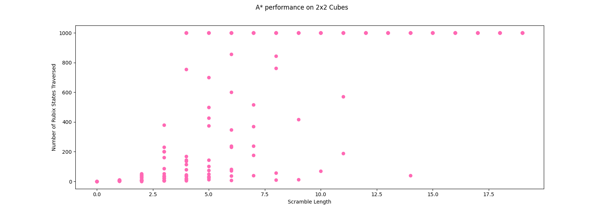

# Evaluation of Rubix AI

### Inspiration

The Rubix Cube AI project was born from a deep-seated fascination with the capabilities of artificial intelligence, particularly its role in unraveling intricate puzzles. At its core, the Rubix Cube represented a captivating platform to explore the profound potential of heuristic-based algorithms in tackling complex problems.

What made the Rubix Cube such a compelling puzzle was its remarkable absence of a clear, predefined pathway to a solution. Unlike many other puzzles with well-defined rules and strategies, the Rubix Cube stood as a perplexing enigma, devoid of an obvious guidebook. This very challenge ignited our curiosity and fueled our determination to dive headfirst into uncharted territory.

The absence of a straightforward strategy to conquer the Rubix Cube transformed this endeavor into an enthralling quest. We found ourselves facing a puzzle that defied convention, a puzzle that dared us to push the boundaries of heuristic models. How far could we stretch these intelligent shortcuts? Where would their effectiveness reach its limit?

The Rubix Cube became a canvas for experimentation, a platform for exploring the intricacies of heuristic-based algorithms. We were driven by the desire to uncover the Rubix Cube's secrets, to decipher the puzzle's hidden patterns and intricacies. It was a journey into the heart of artificial intelligence, where we aimed to craft heuristics that could navigate this intricate labyrinth of colors and rotations

### Implementation and Design Choices of Rubix Cube
The implementation of a Rubix Cube unveiled unexpected challenges. Initially, the assumption was that devising an effective heuristic function would be the most demanding aspect of the project. However, it became evident that implementing the cube itself presented challenges that were on par with heuristic development.

Critical questions arose during the design phase:

1. Structuring Side Rotations: Determining the optimal structure for rotating a side was a pivotal consideration. We aimed to find the simplest and most efficient mechanism for maneuvering individual sides of the cube while ensuring computational efficiency.
2. Navigating Movements: Mapping out how the cube would move presented a puzzle in itself. The challenge extended beyond merely rotating individual sides; it involved orchestrating movements to maintain coherence and accuracy while avoiding unnecessary complexity.

In hindsight, while contemplating an alternate approach involving a graph representation for the cube, we would opt for a dictionary of lists. This implementation choice linked each side to a directional reference from a single face, ensuring stability by keeping central pieces fixed. Central pieces remained stationary regardless of movements, providing a stable framework for the algorithm.

In retrospect, while a graph-based representation might have offered certain advantages in data manipulation, the chosen implementation struck a balance between simplicity and efficiency. It provided a coherent framework for maneuvering the cube's complexities while ensuring computational viability.

### Heuristic Functions

Heuristic functions served as the linchpin of this project, determining the Rubix Cube's navigation through its multifaceted puzzle space. Crafting these heuristic models demanded meticulous consideration of various factors. Here are some of the heuristics explored in the project:

#### Heuristic 1: Number of Colors per side (Best Found)
This heuristic gave us the best balance of complexity and accuracy. While the accuracy was not good enough, it was the best simple heuristic that we were able to intuitively come up with.   

    def heuristic(self):
        h = 0
        for  _, face in self.faces.items():
            numOfColors = len(np.unique(face))-1 
            if numOfColors== 4:
                h += 4
            elif numOfColors == 3:
                h += 2
            elif numOfColors == 2:
                h += 1

        return h

#### Heuristic 2: Total of Pieces out of place
Heuristic 2 placed a strong emphasis on accuracy by quantifying the exact number of pieces that needed to be moved to reach the goal configuration. This design choice prioritized precision in assessing the distance to the goal heuristic(self, goal):
        h = 0
        for  f, face in self.faces.items():
            h += np.sum(face != goal.faces[f])

        return h

#### Heuristic 3: Total of Pieces out of place
Heuristic 3 counted the number of pieces out of place but took a different approach. Instead of comparing each piece to its corresponding position in the goal state, it counted pieces deviating from an expected sequential order of colors

    def heuristic(self):
        sum = 0
        face_count = 0
        for face in goal.faces:
            for block in face:
                if block != str(face_count):
                    sum += 1
            face_count += 1
        return sum

In the forthcoming sections, we'll delve into the analysis and success of these heuristic functions, exploring their performance in the Rubix Cube-solving domain. Our goal is to unravel how these intelligent guides fare in navigating the intricate puzzle and uncover where their strengths and limitations lie.

### Analysis and Success of Heuristic Function
In the figures presented below, we conducted a comprehensive series of experiments to evaluate the performance of our Rubix Cube AI. These experiments involved running 20 trials for each sequence length, ranging from 1 to 20 moves. In total, we amassed 400 data points per image, which enabled us to gain valuable insights into the AI's behavior and efficiency
One striking observation from our experiments was the marked difference in performance between the 2x2 Rubix Cube and the 3x3 Rubix Cube. Notably, the 2x2 cube consistently completed the search much faster than its larger counterpart, the 3x3 cube. This discrepancy in speed can be attributed to the inherent differences in complexity between the two puzzles.

When we examine the figures closely, a clear pattern emerges. The figure depicting the 2x2 cube's outcome reveals that the algorithm executed its search more rapidly while traversing a significantly smaller number of states. This observation aligns with our expectations, as the 2x2 cube boasts a simpler structure with reduced complexity compared to the 3x3 cube.
With the 2x2 cube, we found that the algorithm ran in a shorter timeframe than the 3x3. This makes sense, especially when we look more carefully at the figure.  

The figure depicting the 2x2 cube's outcome reveals that the algorithm executed its search more rapidly while traversing a significantly smaller number of states. This observation aligns with our expectations, as the 2x2 cube boasts a simpler structure with reduced complexity compared to the 3x3 cube.

In contrast, the 3x3 Rubix Cube's search process proved to be more intricate and time-consuming. The AI algorithm, while effective, took longer to complete its search and explored a larger state space. This behavior stems from the increased complexity inherent in solving the 3x3 cube, where additional layers and permutations introduce a higher degree of intricacyIn contrast, the 3x3 Rubix Cube's search process proved to be more intricate and time-consuming. The AI algorithm, while effective, took longer to complete its search and explored a larger state space. This behavior stems from the increased complexity inherent in solving the 3x3 cube, where additional layers and permutations introduce a higher degree of intricacy

The presence of data points approaching or hovering around the 2000 mark deserves particular attention. These data points signify instances in which the algorithm required more than 2000 iterations to reach a solution. To prevent computational overloads and ensure the reliability of our data, we imposed a maximum iteration limit of 2000.

By implementing this safeguard, we aimed to avoid scenarios where the algorithm might run indefinitely, potentially crashing the system. This measure not only ensured the stability of our experiments but also prevented skewed data distribution, enabling us to gain a more accurate understanding of the AI's performance.

The stark contrast in performance between the 2x2 and 3x3 Rubix Cubes underscores the critical role of heuristics in solving complex puzzles. While our heuristics demonstrated effectiveness in navigating the 2x2 cube's simpler terrain, they faced greater challenges when confronted with the 3x3 cube's intricacies.

These findings emphasize the need for further heuristic refinement to tackle more complex puzzles effectively. As the puzzle's size and complexity increase, heuristic models must evolve to accommodate these changes. This necessitates the exploration of more advanced heuristic strategies and the development of intelligent shortcuts that can decipher the multifaceted patterns within the Rubix Cube.

In conclusion, our experiments shed light on the varying degrees of complexity posed by different Rubix Cube configurations. The AI's performance, as reflected in the data, highlights the pivotal role of heuristic models in conquering intricate puzzles. These insights provide valuable guidance for future heuristic development and the pursuit of AI solutions for complex problem-solving domains.
### Citations and Sources

Rubix 3x3 Cube implementation was partially adapted from https://github.com/soqt/Rubix-cube-Q-learning/blob/master/Cube.py
