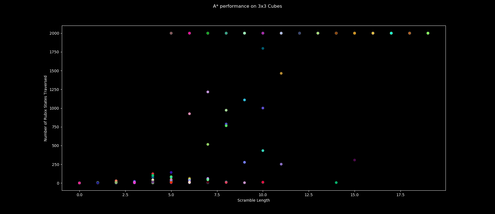

# Evaluation of Rubix AI

### Inspiration

FILL IN

### Implementation and Design Choices of Rubix Cube
It turned out that implementing a Rubix Cube is a bit more challenging than it seems. From my proposal, I assumed coming up with a heuristic function was going to be the hardest task of this project but arguably, it's on par with the implementation of the cube. The main questions behind the Rubix's design choice were: 

- What's the easiest and most efficient structure for turning a side?
- How will movements be made?

In retrospect, implementing a graph to represent a cube could've been better and made it easier to move around data but settling on a dictionary of lists storing each side with respect to a direction from a singular face was a pretty good choice of implementation. Central pieces do not move around because of this implementation meaning that there's only one orientation this code is technically viewing a cube at a given time.

### Heuristic Functions

With heurisitic functions being the key to a successful project, naturally many careful steps should be taken to ensure one is crafted. The following are some of the heuristics tried in this project but does not include all of them.

#### Heuristic 1: Number of Colors per side (Best Found)
--Designchoice goes here---

    def heuristic(self):
        h = 0
        for  _, face in self.faces.items():
            numOfColors = len(np.unique(face))-1 
            if numOfColors== 4:
                h += 4
            elif numOfColors == 3:
                h += 2
            elif numOfColors == 2:
                h += 1

        return h

#### Heuristic 2: Total of Pieces out of place
--Designchoice goes here---

    def heuristic(self, goal):
        h = 0
        for  f, face in self.faces.items():
            h += np.sum(face != goal.faces[f])

        return h

#### Heuristic 3: Total of Pieces out of place
--Designchoice goes here---

    def heuristic(self):
        sum = 0
        face_count = 0
        for face in goal.faces:
            for block in face:
                if block != str(face_count):
                    sum += 1
            face_count += 1
        return sum

### Analysis and Success of Heuristic Function

In the below figures, we conducted a series of experiments.

The parameters ran 20 runs of a sequences ranging of length 1 to 20. Leading to approximately 400 data points being plotted.

-- Talk about 2x2 shapes and interesting things found, also mention the state space of a 2x2.

If there exist a point around 2000 it's likely denoting that the algorithm required more than 2000 turns to take which is the maxIterations set for runnign the experiment.

### Citations and Sources

Rubix 3x3 Cube implementation was partially adapted from https://github.com/soqt/Rubix-cube-Q-learning/blob/master/Cube.py
